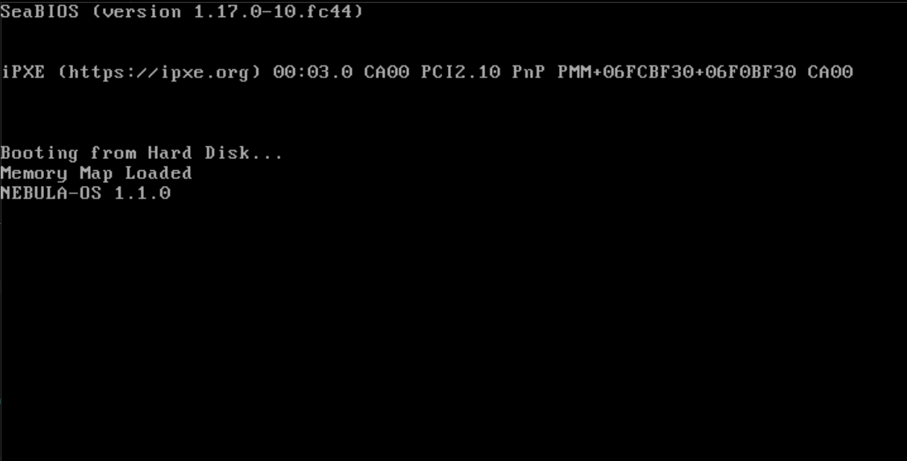
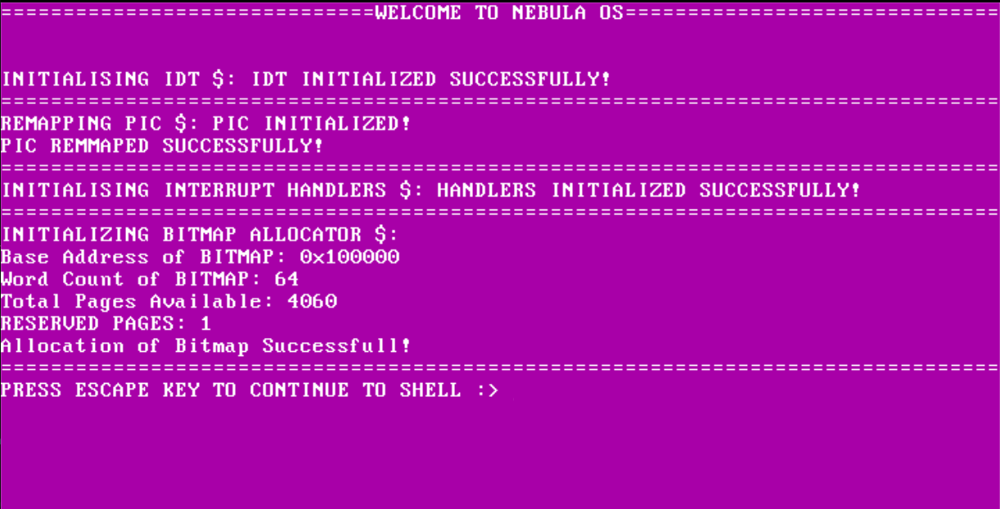
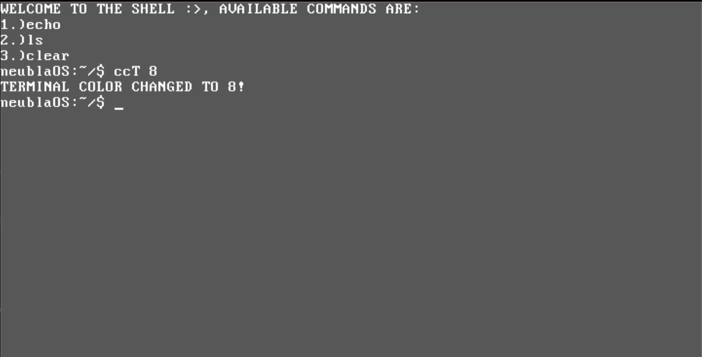

# Nebula-OS

A 32-bit x86 operating system written from scratch in C and Assembly. Nebula-OS features a custom bootloader, memory management, interrupt handling, and an interactive shell.

## Table of Contents

- [Overview](#overview)
- [Features](#features)
- [Architecture](#architecture)
- [Memory Map](#memory-map)
- [Shell Commands](#shell-commands)
- [Building and Running](#building-and-running)
- [Project Structure](#project-structure)
- [Technical Specifications](#technical-specifications)
- [Demo](#demo)

## Overview

Nebula-OS is a hobbyist operating system designed to run on x86 architecture in protected mode. It provides a foundation for understanding low-level system programming concepts including bootloaders, memory management, interrupt handling, and driver development.

**Version:** 1.1.0  
**Architecture:** x86 (32-bit)  
**Bootloader:** Custom sector-based bootloader  
**Kernel Entry:** 0x7e00  

## Features

- **Custom Bootloader**: Hand-written assembly bootloader that loads the kernel and sets up protected mode
- **Memory Management**: Bitmap-based memory allocator using E820 memory map
- **Interrupt Handling**: IDT and ISR support for handling hardware interrupts and exceptions
- **Keyboard Driver**: PS/2 keyboard driver with buffer management
- **Display Driver**: VGA text mode driver with color support (16 colors)
- **Interactive Shell**: Command-line interface with built-in commands
- **PIT Driver**: Programmable Interval Timer support
- **PIC Remapping**: 8259 Programmable Interrupt Controller remapping
- **Double Buffer VGA Driver**: Prevents Screen Tearing and ensures smooth rendering

## Architecture

### Boot Process

1. **BIOS Handoff** (0x7C00)
   - Bootloader loaded from disk sector 1
   - Real-mode execution begins
   - Stores boot disk identifier

2. **Bootloader Initialization**
   - Loads E820 memory map to 0x90010
   - Enables A20 line for memory addressing above 1MB
   - Loads kernel (128 sectors = 64KB) to 0x7e00
   - Sets up Global Descriptor Table (GDT)
   - Transitions to protected mode

3. **Kernel Entry** (0x7e00)
   - 32-bit protected mode execution
   - Segment registers initialized
   - Stack set up at 0x90000
   - Jump to kernel_main()

4. **Kernel Initialization**
   - IDT setup and initialization
   - PIC remapping (IRQ 0-15)
   - Interrupt handler registration
   - Memory bitmap initialization
   - Shell activation

### System Components

```
┌────────────────────────────────┐
│         User Space (Shell)     │
├────────────────────────────────┤
│         Kernel Services        │
│  ┌──────────┐  ┌──────────┐    │
│  │ Display  │  │ Keyboard │    │
│  │  Driver  │  │  Driver  |    │
│  └──────────┘  └──────────┘    │
│  ┌──────────┐  ┌──────────┐    │ 
│  │    PIT   │  │  Memory  │    │
│  │  Driver  │  │ Manager  │    │
│  └──────────┘  └──────────┘    │
├────────────────────────────────┤
│      Hardware Abstraction      │
│  ┌──────────┐  ┌──────────┐    │
│  │   IDT    │  │   PIC    │    │
│  │   /ISR   │  │ Remapping│    │
│  └──────────┘  └──────────┘    │
├────────────────────────────────┤
│        Hardware Layer          │
│  CPU,Memory,Keyboard,VGA,PIT   │
└────────────────────────────────┘
```

## Memory Map

### Physical Memory Layout

| Address Range | Size | Description |
|--------------|------|-------------|
| 0x00000000 - 0x0007FFF | 32KB | Reserved (IVT, BDA) |
| 0x00007C00 - 0x00007DFF | 512B | Bootloader (Sector 1) |
| 0x00007E00 - 0x000FFFFF | ~488KB | Kernel code and data |
| 0x00090000 - 0x000900FF | 256B | Memory map entry count |
| 0x00090010 - 0x00090FFF | ~4KB | E820 Memory map buffer |
| 0x000B8000 - 0x000BFFFF | 32KB | VGA text mode buffer |
| 0x00100000+ | Variable | Available RAM (from E820) |

### Kernel Memory Sections

| Section | Address | Alignment | Description |
|---------|---------|-----------|-------------|
| .text | 0x7e00 | 16-byte | Code section |
| .data | Dynamic | 16-byte | Initialized data |
| .bss | Dynamic | 16-byte | Uninitialized data |

### VGA Memory

- **Base Address:** 0xB8000
- **Resolution:** 80x25 characters
- **Total Size:** 80 × 25 × 2 = 4000 bytes
- **Format:** Each character = 1 byte ASCII + 1 byte attribute (color)

### Memory Map Entry Structure

```c
typedef struct __attribute__((packed)) {
    uint64_t base_address;  // Base address of memory region
    uint64_t length;        // Length of memory region in bytes
    uint32_t type;          // Type of memory region (1 = usable)
    uint32_t acpi;          // ACPI 3.0 extended attributes
} memory_map_entry_t;
```

## Shell Commands

NebulaOS includes an interactive shell with the following built-in commands:

| Command | Description | Usage |
|---------|-------------|-------|
| `echo` | Print text to the screen | `echo [text]` |
| `ls` | List available programs | `ls` |
| `clear` | Clear the screen | `clear` |
| `ccT` | Change terminal background color | `ccT [0-15]` |
| `cct` | Change text color | `cct [0-15]` |

### Color Codes

The following color values can be used with `ccT`和 `cct` commands:

| Value | Color | Value | Color |
|-------|-------|-------|-------|
| 0 | Black | 8 | Dark Grey |
| 1 | Blue | 9 | Light Blue |
| 2 | Green | 10 | Light Green |
| 3 | Cyan | 11 | Light Cyan |
| 4 | Red | 12 | Light Red |
| 5 | Magenta | 13 | Light Magenta |
| 6 | Brown | 14 | Light Brown |
| 7 | Light Grey | 15 | White |

### Example Usage

```bash
neublaOS:~/$ echo Hello, World!
Hello, World!
neublaOS:~/$ ls
AVAILABLE PROGRAMS:
1: ccT [num]: to change terminal color (0-15)
2: cct [num]: to change text color (0-15)
neublaOS:~/$ ccT 1
TERMINAL COLOR CHANGED TO 1!
neublaOS:~/$ cct 15
TEXT COLOR CHANGED TO 15!
neublaOS:~/$ clear
```

## Building and Running

### Prerequisites

- **NASM** (Netwide Assembler) - for assembling boot code
- **i686-elf-gcc** - cross-compiler for x86
- **GNU ld** - linker
- **QEMU** - for running/testing the OS

### Build Instructions

```bash
# Build the OS image
make

# Clean build artifacts
make clean

# Run in QEMU
make run

# Run with GDB debugging support
make debug
```

### Build Output

- `bin/os.img` - Final OS image (boot.bin + kernel.bin)
- `bin/boot.bin` - Bootloader binary
- `bin/kernel.bin` - Raw kernel binary
- `build/kernel.elf` - ELF kernel with debug symbols

## Project Structure

```
Nebula-OS/
├── Scripts/
│   ├── headers/           # Header files
│   │   ├── bitmap.h       # Bitmap memory management
│   │   ├── debug.h        # Debug utilities
│   │   ├── display.h      # VGA display driver
│   │   ├── handler_init.h # Interrupt handler init
│   │   ├── idt.h          # Interrupt Descriptor Table
│   │   ├── io.h           # I/O port operations
│   │   ├── isr.h          # Interrupt Service Routines
│   │   ├── isr_setup.h    # ISR setup utilities
│   │   ├── keyboard.h     # Keyboard driver
│   │   ├── pic.h          # Programmable Interrupt Controller
│   │   ├── pit.h          # Programmable Interval Timer
│   │   └── shell.h        # Shell interface
│   ├── src/
│   │   ├── boot.asm       # Main bootloader
│   │   ├── kernel_entry.asm # Kernel entry point
│   │   ├── kernel.c       # Main kernel logic
│   │   ├── handler_init.c # Handler initialization
│   │   ├── cpu/           # CPU-related code
│   │   │   ├── idt.asm    # IDT assembly
│   │   │   ├── idt.c      # IDT implementation
│   │   │   ├── isr.asm    # ISR assembly stubs
│   │   │   ├── isr.c      # ISR implementation
│   │   │   └── pic.c      # PIC implementation
│   │   ├── drivers/       # Hardware drivers
│   │   │   ├── display.c  # VGA display driver
│   │   │   ├── keyboard.c # PS/2 keyboard driver
│   │   │   └── pit.c      # PIT driver
│   │   ├── memory/        # Memory management
│   │   │   └── bitmap.c   # Bitmap allocator
│   │   ├── shell/         # Shell implementation
│   │   │   └── shell.c    # Shell command parser
│   │   ├── io/            # I/O operations
│   │   │   └── io.asm     # Port I/O assembly
│   │   └── debug_codes/   # Debug utilities
│   │       └── call_interrupts.c
│   └── herlperScripts/    # Helper scripts
│       ├── isr_asm_helper.py
│       ├── isr_helper.py
│       └── triggerINT.asm
├── linker.ld              # Linker script
├── Makefile               # Build configuration
└── README.md              # This file
```

## Technical Specifications

### Compiler Flags

```makefile
CFLAGS  := -ffreestanding -O3 -Wall -Wextra -fno-stack-protector -g -IScripts/headers
LDFLAGS := -m elf_i386 -T linker.ld
ASMFLAGS = -f elf32
```

### GDT (Global Descriptor Table)

| Selector | Base | Limit | Type | Description |
|----------|------|-------|------|-------------|
| 0x00 | 0x00000000 | 0x00000 | NULL | Null descriptor |
| 0x08 | 0x00000000 | 0xFFFFF | Code | Code segment (read/execute) |
| 0x10 | 0x00000000 | 0xFFFFF | Data | Data segment (read/write) |

### Interrupt Vectors

- **IRQ 0:** PIT (Timer)
- **IRQ 1:** Keyboard
- **IRQ 2-15:** Reserved for future use

### Keyboard Buffer

- **Size:** 2000 bytes
- **Location:** Global buffer in keyboard driver
- **Management:** Circular buffer with position tracking

### Display Buffer

- **Size:** 80 × 25 = 2000 characters
- **Format:** 16-bit per character (8-bit ASCII + 8-bit color attribute)
- **Scrolling:** Automatic scroll when buffer is full

## Demo

## [Watch the video demo!](https://www.youtube.com/watch?v=4ftPqv-wHsc)


### Screenshots

**Boot Loader**


**Boot Screen**


**Shell Interface**


## Development Status

### Completed Features
- ✅ Custom bootloader with protected mode transition
- ✅ E820 memory map detection
- ✅ Bitmap memory management
- ✅ IDT and ISR implementation
- ✅ PIC remapping
- ✅ VGA text mode driver
- ✅ PS/2 keyboard driver
- ✅ Interactive shell with basic commands
- ✅ Color customization

### Planned Features
- ⏳ File system support
- ⏳ Process management
- ⏳ System calls
- ⏳ More shell commands
- ⏳ GUI support

## Contributing

This is a personal learning project. Contributions and suggestions are welcome!

## Acknowledgments

- Special Thanks to Smash (Auritro) and Yasho Bhaiya for their help support and encouragement :)
